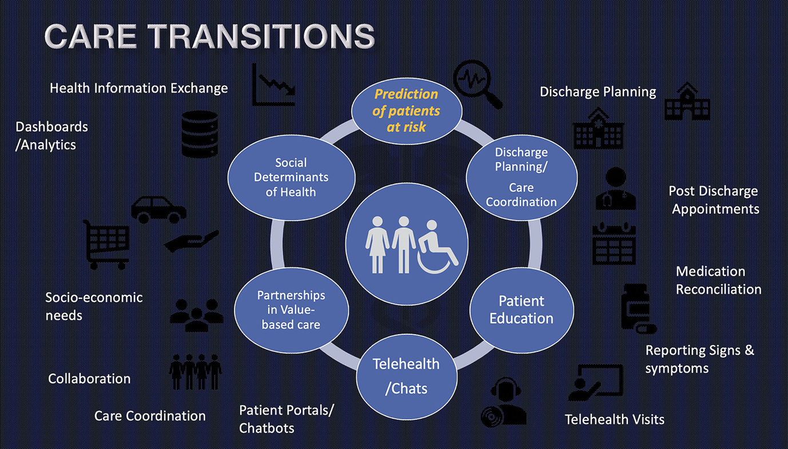

# Module 5 Final Project - Predicting 30-day Hospital Readmission

Student name: **Cynthia Pedrasa**  
Student pace: **self paced**  
Scheduled project review date/time:  **Monday, Jun 15, 2020 Time: 10:00am-11:00am (EDT)**  
Instructor name: **Jeff Herman**  
Deliverables:
1. Jupyter Notebooks:
    a. https://github.com/cynthiapedrasa/predicting-30-day-readmission/blob/master/Part_1_Data_Preprocessing.ipynb
    b. https://github.com/cynthiapedrasa/predicting-30-day-readmission/blob/master/Part_2_Model_Evaluation.ipynb

2. Blog Post: https://cpedrasa.github.io/predicting_30-day_hospital_readmisssions

3. Executive Summary: https://github.com/cynthiapedrasa/predicting-30-day-readmission/blob/master/Predicting_Hospital_Readmissions.pdf


## Introduction

For the final project for Module 5, we have chosen a binary classification project on predicting 30-day Readmisssion Risk of patients with Diabetes. 


## Objectives

Hospital readmissions are associated with unfavorable patient outcomes and high financial costs.  

* The Medicare Payment Advisory Commission (MedPAC) reported that in 2005, 17.6% of hospital admissions resulted in readmissions within 30 days of discharge, 11.3% within 15 days, and 6.2% within 7 days. [National Conference of State Legislatures](https://www.ncsl.org/documents/health/medicare_hospital_readmissions_and_ppaca.pdf)

* Diabetes is one of the most frequently treated condition in US Hospitals with 20.3% readmission rate.
[Agency for Healthcare Research and Quality](https://www.hcup-us.ahrq.gov/reports/statbriefs/sb153.pdf)

* Healthcare Regulatory Agencies are focused on 30-day readmission rates as a way to improve quality. The Centers for Medicare and Medicaid Services (CMS) have labeled 30-day readmission rates as a measure of healthcare quality and emphasize its reduction as a strategy to reduce healthcare costs while also maintaining quality.  Some of these mandatory and/or voluntary programs are as follows:

    * Hospital Readmissions Reduction Program (HRRP) is a Medicare value-based purchasing program that reduces payments to hospitals with excess readmissions. The Affordable Care Act established the Hospital Readmissions Reduction Program to improve the quality of care while reducing costs. The program incentivizes hospitals to improve communication and care coordination efforts, and to better engage patients and caregivers, with respect to post-discharge planning. 
    * Bundled Payments for Care Improvement Advanced (BPCIA). An alternative payment model to incentivize financial accountability, care redesign, data analysis and feedback, provider engagement, and patient engagement with bundled payments, care redesign activities, and accountability for performance on quality measures. This program links reimbursement or payment to the quality of care provided during a specific episode period.
    * Comprehensive Care for Joint Replacement (CJR) model is an episode payment model that uses bundled payments for clinical episodes focused on lower extremity joint replacements
    * Medicare Shared Savings Program (MSSP) is a voluntary program that encourages groups of doctors, hospitals, and other health care providers to come together as an Accountable Care Organization (ACO) to give coordinated, high quality care to their Medicare patients. This program showed greater reductions in readmission rates.  
    * Delivery System Reform Incentive Payment (DSRIP) Program is the main mechanism by which New York State will implement the Medicaid Redesign Team (MRT) Waiver Amendment. DSRIP´s purpose is to restructure the health care delivery system by reinvesting in the Medicaid program, with the primary goal of reducing avoidable hospital use by 25% over 5 years. Up to $6.42 billion dollars are allocated to this program with payouts based upon achieving predefined results in system transformation, clinical management and population health.

A successful predictive model will help the Healthcare Organization:  

* Pinpoint patients with high readmission risk to reduce the occurrences of preventable hospital readmissions and avoidable admissions.  
* Out-predict common approaches to readmission risk stratification by rendering more precise and complete views into patient predispositions by using patient characteristics and other comorbidity index computations in enabling the patient level predictions  
* Improve resource utilization and increase operational efficiency  
* Improve hospital rating based on lower readmission rate and increased patient satisfaction  
* A positive financial return is expected from the readmission and avoidable admission reduction rate.  Revenue generation by decreasing the hospital’s excess readmission ratio that reduces payments for hospitals whose 30-day readmission rates are high relative to other facilities  


 <center></center>

## The Project

   ### Data Science Workflow 
   
Understanding the typical work flow on how the data science process works is important in business understanding and problem solving. Using the OSEMN Framework the student will go through the different steps of the framework in an iterative and non-linear process. 

 + **O.** Obtain the data - Requirements and information gathering on the problem.
 + **S.** Scrubbing - Pre-processing our data (removing nulls, outliers, normalization, feature selection)
 + **E.** Explore-Understand the cohort characteristics and impactful predictors
 + **M.** Modeling the data - Build and tune the model
 + **N.** iNterpret the Data and communicate results to stakeholders

In this Module 5 Project, the student will build and test different binary classifier algorithms to predict 30-day hospital readmissions of patients with diabetes, based on the electronic medical records. The models will be tuned to improve accuracies and the model with the best score will be selected to make accurate predictions of data.  
Part I of the project includes the Introduction, data load, data scrubbing thru completion of pre-processing of the final dataframe.
Part II of the project includes the Data Modeling, tuning, evaluation, performance metrics and finalization/saving of the model. for later prediction use.


 In this project we would like to find the answers to the following questions:
 + Who among the hospitalized Diabetic patients are at risk for 30-day hospital readmissions?
 + How can we risk stratify and rank patient/encounters with the highest probability of getting readmitted within 30 days? 
 + Which features are important predictors of 30-day readmission in patients with Diabetes?
 + Are HbA1c result, changes in treatment, and glycemic factors significant contributors to readmissions? 


### Hospital Readmissions Diabetes Data Set 
[UCI Machine Learning Datasets Repository](https://archive.ics.uci.edu/ml/datasets/diabetes+130-us+hospitals+for+years+1999-2008)

The dataset represents 10 years (1999-2008) of clinical care at 130 US hospitals and integrated delivery networks. It includes over 50 features representing patient and hospital outcomes. Information was extracted from the database for encounters that satisfied the following criteria.

1. It is an inpatient encounter (a hospital admission)   
2. It is a diabetic encounter, that is, one during which any kind of diabetes was entered to the system as a diagnosis.
3. The length of stay was at least 1 day and at most 14 days.
4. Laboratory tests were performed during the encounter.
5. Medications were administered during the encounter.


#### DATA-SPECIFIC INFORMATION FOR: [diabetic_data.csv]

1. Number of variables: 50
2. Number of instances/rows: 101766
3. Variable List: 

**Target Variable:**

|Attribute|Description|
|:---|:---|
|**Readmitted**|Days to inpatient readmission. Values: “<30” if the patient was readmitted in less than 30 days, “>30” if the patient was readmitted in more than 30 days, and “No” for no record of readmissionFeatures:|


**Predictors:**

|Attribute|Description|
|:---|:---|
|**Encounter ID**| Unique identifier of an encounter|
|**Patient number**| Unique identifier of a patient|
|**Race Values**|  Caucasian, Asian, African American, Hispanic, and other|
|**Gender**|  male, female, and unknown/invalid|
|**Age**| Grouped in 10-year intervals: 0, 10), 10, 20), …, 90, 100)|
|**Weight**| Weight in pounds|
|**Admission type**| Integer identifier corresponding to 9 distinct values, for example, emergency, urgent, elective, newborn, and not available|
|**Discharge disposition**|  Integer identifier corresponding to 29 distinct values, for example, discharged to home, expired, and not available|
|**Admission source**|  Integer identifier corresponding to 21 distinct values, for example, physician referral, emergency room, and transfer from a hospital|
|**Time in hospital**| Integer number of days between admission and discharge|
|**Payer code**| Integer identifier corresponding to 23 distinct values, for example, Blue Cross/Blue Shield, Medicare, and self-pay Medical|
|**Medical specialty**| Integer identifier of a specialty of the admitting physician, corresponding to 84 distinct values, for example, cardiology, internal medicine, family/general practice, and surgeon|
|**Number of lab procedures**| Number of lab tests performed during the encounter|
|**Number of procedures**| Numeric Number of procedures (other than lab tests) performed during the encounter|
|**Number of medications**| Number of distinct generic names administered during the encounter|
|**Number of outpatient visits**| Number of outpatient visits of the patient in the year preceding the encounter|
|**Number of emergency visits**| Number of emergency visits of the patient in the year preceding the encounter|
|**Number of inpatient visits**| Number of inpatient visits of the patient in the year preceding the encounter|
|**Diagnosis 1**| The primary diagnosis (coded as first three digits of ICD9); 848 distinct values|
|**Diagnosis 2**| Secondary diagnosis (coded as first three digits of ICD9); 923 distinct values|
|**Diagnosis 3**| Additional secondary diagnosis (coded as first three digits of ICD9); 954 distinct values|
|**Number of diagnoses**| Number of diagnoses entered to the system 0%|
|**Glucose serum test result**| Indicates the range of the result or if the test was not taken. Values: “>200,” “>300,” “normal,” and “none” if not measured|
|**A1c test result**| Indicates the range of the result or if the test was not taken. Values: “>8” if the result was greater than 8%, “>7” if the result was greater than 7% but less than 8%, “normal” if the result was less than 7%, and “none” if not measured.|
|**Change of medications**|  Indicates if there was a change in diabetic medications (either dosage or generic name). + + Values: “change” and “no change”|
|**Diabetes medications**| Indicates if there was any diabetic medication prescribed. Values: “yes” and “no”|
|**24 features for medications**|  For the generic names: metformin, repaglinide, nateglinide, chlorpropamide, glimepiride, acetohexamide, glipizide, glyburide, tolbutamide, pioglitazone, rosiglitazone, acarbose, miglitol, troglitazone, tolazamide, examide, sitagliptin, insulin, glyburide-metformin, glipizide-metformin, glimepiride- pioglitazone, metformin-rosiglitazone, and metformin- pioglitazone, the feature indicates whether the drug was prescribed or there was a change in the dosage. Values: “up” if the dosage was increased during the encounter, “down” if the dosage was decreased, “steady” if the dosage did not change, and “no” if the drug was not prescribed|


4. **Missing data codes:** 

|Attributes with Null values|Description|
|:---|:---|
|race | 2273 |
|weight| 98569|
|payer_code| 40256 |
|medical_specialty| 49949 |
|diag_1 | 21|
|diag_1| 358|
|diag_3 | 1423|  


### Prerequisites

You may need to install some software and packages.


1. Install Anaconda (https://docs.anaconda.com/anaconda/install/)

2. Install Scikit-learn (https://anaconda.org/anaconda/scikit-learn)
```console
conda install -c anaconda scikit-learn
```

3. Install Imbalanced-Learn Library (https://anaconda.org/conda-forge/imbalanced-learn)
```console
conda install -c conda-forge imbalanced-learn
```

4. Install XGBoost Library (https://anaconda.org/conda-forge/xgboost)
```console
conda install -c conda-forge xgboost
```

     

## Acknowledgments

* Dataset: (https://archive.ics.uci.edu/ml/datasets/diabetes+130-us+hospitals+for+years+1999-2008)
* Beata Strack, Jonathan P. DeShazo, Chris Gennings, Juan L. Olmo, Sebastian Ventura, Krzysztof J. Cios, and John N. Clore, “Impact of HbA1c Measurement on Hospital Readmission Rates: Analysis of 70,000 Clinical Database Patient Records,” BioMed Research International, vol. 2014, Article ID 781670, 11 pages, 2014.(https://www.hindawi.com/journals/bmri/2014/781670/)
* The inspiration for class imbalance techniques come from Jason Brownlee PhD website and book  
    - Imbalance Classification Techniques/Codes -  (https://machinelearningmastery.com/what-is-imbalanced-classification/)
    - Precision Recall Curves for imbalanced classification - https://machinelearningmastery.com/roc-curves-and-precision-recall-curves-for-classification-in-python/


